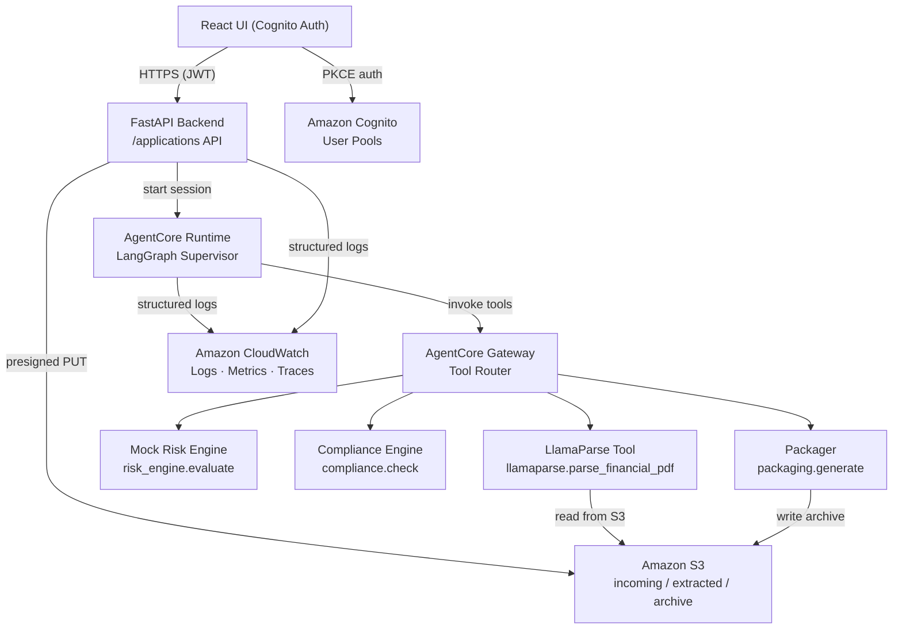

# Consumer Loan Origination AI

An enterprise-styled, agentic consumer loan origination system built as a side project
demonstrating production-quality architecture on AWS.

## Stack

| Layer | Technology |
|---|---|
| Orchestration | LangGraph (Supervisor + specialist subgraphs) |
| Agent hosting | Amazon Bedrock AgentCore Runtime & Gateway |
| Infrastructure | Terraform (VPC, IAM, S3, ALB, Cognito, CloudWatch) |
| Document parsing | LlamaParse (Llama Cloud) |
| Backend API | FastAPI + Pydantic v2 |
| Frontend | React 19 + Vite + TypeScript |
| Python deps | UV (all workspaces) |
| Auth | Amazon Cognito (JWT / OIDC) |
| Risk engine | Deterministic mock (PRIME / NEAR_PRIME / SUBPRIME) |

## Architecture



## Mono-repo Layout

```
/
├── backend/          FastAPI application (API layer)
├── agents/           LangGraph supervisor + specialist subgraphs + tools
├── shared/           Pydantic v2 canonical schemas (shared across packages)
├── evaluation/       Golden-case replay harness & evaluation metrics
├── infra/            Terraform modules and environment compositions
├── frontend/         React + Vite + TypeScript UI
├── scripts/          Developer utilities (env loading, teardown, etc.)
└── docs/             Requirements, design, ADRs, runbooks, implementation plan
```

## Prerequisites

- Python 3.12+
- [UV](https://docs.astral.sh/uv/) (Python dependency manager — used exclusively)
- Node.js 20+
- Terraform 1.7+
- AWS CLI v2 + configured profile
- Llama Cloud account (LlamaParse API key)

## Quick Start (Local Dev)

```bash
# 1 — Clone and install all Python workspaces
uv sync --all-packages

# 2 — Install and start the frontend
cd frontend && npm install && npm run dev

# 3 — Load environment variables (see .env.example files)
source scripts/load_env.sh

# 4 — Run the backend API (local mode, in-process LangGraph)
cd backend && uv run uvicorn backend.main:app --reload

# 5 — Run all tests
uv run pytest
```

## Environment Setup

Copy and populate the example env files before running:

```bash
cp backend/.env.example backend/.env
cp agents/.env.example agents/.env
cp frontend/.env.example frontend/.env
```

Never commit `.env` files. See `docs/adr/0001-stack-choices.md` for secrets-management rationale.

## Key Design Decisions

See [`docs/adr/0001-stack-choices.md`](docs/adr/0001-stack-choices.md) for the full Architecture Decision Record.

## Implementation Plan

See [`docs/implementation-plan.md`](docs/implementation-plan.md) for the phased task plan (Phases 0–7).

## Conventional Commits

This repo follows [Conventional Commits](https://www.conventionalcommits.org/):

```
feat:     new feature
fix:      bug fix
infra:    infrastructure change
chore:    tooling / maintenance
docs:     documentation
test:     test additions / changes
refactor: code restructuring without behaviour change
```
