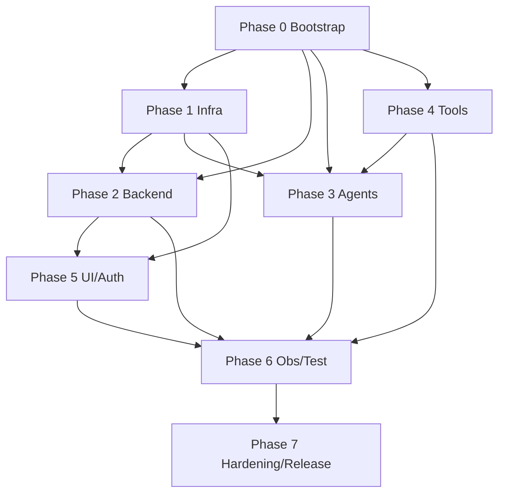

# Implementation Plan – Agentic Loan Origination System (LangGraph + AgentCore + Terraform)

> Execution-oriented plan for a solo builder. Every task row is sized to convert directly into a GitHub Issue.
> Stack: LangGraph (Supervisor + specialist subgraphs) · Amazon Bedrock AgentCore (Runtime + Gateway) · Terraform · LlamaParse · FastAPI · React · UV for all Python dependency management. Mocked deterministic risk engine only — no real bureau integrations.

---

## 1. Executive Summary & Assumptions

### 1.1 Summary
This plan delivers an enterprise-styled, agentic consumer loan origination system as a solo side project. A React UI (Cognito-authenticated) submits applications and uploads synthetic PDFs to S3. A FastAPI backend (Pydantic v2, async, DI) starts an AgentCore Runtime session running a LangGraph supervisor. The supervisor orchestrates specialist subgraphs that parse documents (LlamaParse), normalize to a canonical schema, evaluate a deterministic mock risk engine (`risk_engine.evaluate`), run rule-based compliance, make a decision, and package JSON + PDF artifacts into S3. All infra is Terraform-managed (VPC, subnets, SGs, IAM, ALB, S3, CloudWatch, Cognito, AgentCore hooks). Observability, a golden-case replay harness, and drift detection close the loop.

### 1.2 Owner Role Legend (single builder wearing hats)
- **PLT** – Platform / IaC Engineer (Terraform, AWS, networking, IAM)
- **BE** – Backend Engineer (FastAPI, schemas, S3, auth integration)
- **AI** – AI / Agent Engineer (LangGraph, AgentCore, tools, Guardrails)
- **FE** – Frontend Engineer (React, hooks, auth UX)
- **QA** – Quality / Evaluation Engineer (tests, golden cases, drift)
- **SEC** – Security / Release Engineer (least-privilege audit, hardening)

### 1.3 Complexity Legend
S = < 0.5 day · M = 0.5–2 days · L = > 2 days (split if it grows).

### 1.4 Key Assumptions
| # | Assumption | Impact if false |
|---|---|---|
| A1 | A single AWS account (sandbox) with admin bootstrap access is available; one region (e.g. `us-east-1`) hosts everything. | Cross-account IAM and region wiring would add tasks. |
| A2 | Amazon Bedrock AgentCore Runtime + Gateway are available in the chosen region and reachable via SDK/CLI; Terraform coverage may be partial and require wrapper automation. | Phase 1/3 AgentCore tasks fall back to scripted (boto3/CLI) provisioning. |
| A3 | A Llama Cloud account + LlamaParse API key exist; usage stays within free/dev tier. | Doc-processing tasks need a local fallback parser stub. |
| A4 | All data is synthetic; no real PII, no real bureau, no production traffic. | Compliance/security scope would expand materially. |
| A5 | Python 3.12+, Node 20+, Terraform 1.7+, UV, and AWS CLI v2 are installed locally. | Phase 0 bootstrap must add install steps. |
| A6 | Single demo environment (no multi-env promotion) for v1; enterprise multi-env is backlog. | Adds workspace/env separation tasks later. |
| A7 | Mock risk policy bands (PRIME/NEAR_PRIME/SUBPRIME) are product config, not real credit standards, and live in version-controlled config. | Golden cases and drift detection must be re-baselined. |

---

## 2. Phased Implementation Plan

Phases are numbered 0–7. Each phase below carries: Objective · Business Justification · Entry Criteria · Task Table · Deliverables & Exit Criteria · Risks/Blockers/Dependencies.

Task ID convention: `P{phase}-T{n}`.

---

### Phase 0 — Bootstrap

**Objective:** Stand up the mono-repo, toolchain, shared schemas, and CI so every later phase has a consistent, reproducible foundation.

**Business Justification:** A disciplined scaffold (UV-managed Python, typed shared contracts, CI gates) prevents rework and enforces the "stable tool contracts" principle from the design doc. It is the cheapest place to lock in quality.

**Entry Criteria & Prerequisites:** Local tooling installed (A5); empty repo with `docs/requirements.md` and `docs/design.md`; Llama Cloud + AWS sandbox credentials obtainable.

| Task ID | Task Name | Inputs / Outputs | Dependencies | Complexity | Owner | Concrete Acceptance Criteria & Implementation Notes |
|---|---|---|---|---|---|---|
| P0-T1 | Initialize git mono-repo & layout | In: empty dir · Out: `/backend`, `/agents`, `/infra`, `/frontend`, `/shared`, `/evaluation`, `/docs`, `/scripts` | — | S | PLT | `git init`; top-level README describing each dir; `.gitignore` for Python/Node/Terraform/`.DS_Store`. Conventional-commits noted in README. |
| P0-T2 | UV-based Python workspaces | In: P0-T1 · Out: `pyproject.toml` per Python package (`backend`, `agents`, `shared`, `evaluation`), `uv.lock` | P0-T1 | M | BE | `uv init`/`uv add` used exclusively (no pip). `uv sync` reproduces envs from lockfile. `requires-python = ">=3.12"`. `shared` installed as editable workspace dep by others. |
| P0-T3 | Shared canonical Pydantic v2 schema package | In: design §5.2/§6.3, requirements §5.2 · Out: `shared/schemas/` models (CanonicalApplication, Document, PayStubFields, BankStatementFields, RiskRequest, RiskResponse, ComplianceResult, Decision, AuditContext) | P0-T2 | L | BE | All models Pydantic v2 with `model_config = ConfigDict(populate_by_name=True)`, camelCase aliases on API-facing models, enums for `RiskProfile`/`DocumentType`/`DecisionOutcome`. `uv run python -c "import shared.schemas"` passes. No business logic in schema package. |
| P0-T4 | Python quality gates | In: P0-T2 · Out: `black`, `isort` (profile=black), `ruff`/`pylint`, `mypy`, `pytest` config in `pyproject.toml` (line-length 120) | P0-T2 | S | QA | `uv run black --check .`, `uv run isort --check .`, `uv run pytest` all runnable. Configs match backend rule (line-length 120, isort profile black, `pythonpath=["src"]`). |
| P0-T5 | Frontend scaffold (React + Vite + TS) | In: P0-T1 · Out: `/frontend` Vite + React + TypeScript app, ESLint + Prettier, `package.json` | P0-T1 | M | FE | `npm run dev` serves a placeholder shell; `npm run build` succeeds; ESLint + Prettier configured; TS strict mode on; React Router installed. |
| P0-T6 | Local config & secrets convention | In: A3/A5 · Out: `.env.example` files (backend, agents, frontend), `scripts/load_env.sh`, AWS profile docs | P0-T2 | S | SEC | No secrets committed (enforced by `.gitignore` + pre-commit secret scan). Documents `LLAMA_CLOUD_API_KEY`, `AWS_PROFILE`, Cognito IDs sourced from env/SSM, never hardcoded. |
| P0-T7 | Pre-commit hooks | In: P0-T4 · Out: `.pre-commit-config.yaml` | P0-T4, P0-T6 | S | QA | Hooks: black, isort, ruff, detect-secrets, end-of-file/trailing-whitespace. `pre-commit run --all-files` green. |
| P0-T8 | CI skeleton (GitHub Actions) | In: P0-T4, P0-T5 · Out: `.github/workflows/ci.yml` | P0-T4, P0-T5 | M | QA | Jobs: python-lint+test (uv), frontend-lint+build, terraform-fmt+validate (stub until Phase 1). Triggers on PR + push to main. Caches uv + npm. |
| P0-T9 | Architecture & ADR docs | In: design.md · Out: `docs/adr/0001-stack-choices.md`, high-level architecture diagram (mermaid) | P0-T1 | S | PLT | ADR records LangGraph/AgentCore/Terraform/LlamaParse choices and the mock-engine boundary decision. Diagram mirrors design §3.1 five-layer model. |

**Deliverables & Exit Criteria:** Repo builds locally; `uv sync` + `npm install` succeed; CI green on an empty PR; shared schema package importable and typed; secrets convention documented; no secrets in history.

**Risks / Blockers / Dependencies:** Risk of over-scaffolding — keep schemas minimal and grow them per phase. No upstream dependencies. Blocks every other phase.

---

### Phase 1 — Infrastructure (Terraform)

**Objective:** Provision the full AWS baseline (network, security, storage, edge, auth, observability, AgentCore hooks) as modular, least-privilege Terraform.

**Business Justification:** Reproducible IaC is the demonstrable "production discipline" centerpiece. Network zoning, least-privilege IAM, and TLS-everywhere are the security backbone every other layer assumes.

**Entry Criteria & Prerequisites:** Phase 0 complete; AWS sandbox account + admin bootstrap credentials (A1); region chosen; AgentCore availability confirmed (A2).

| Task ID | Task Name | Inputs / Outputs | Dependencies | Complexity | Owner | Concrete Acceptance Criteria & Implementation Notes |
|---|---|---|---|---|---|---|
| P1-T1 | Terraform remote state backend | In: AWS creds · Out: S3 state bucket + DynamoDB lock table, `backend.tf` | P0-T1 | S | PLT | State bucket versioned + SSE-KMS + public-access-blocked; Dynamo lock table active; `terraform init` connects. Bootstrapped via a separate minimal stack to avoid chicken-egg. |
| P1-T2 | Networking module (VPC) | In: design §11.1/§11.2 · Out: `infra/modules/network` (VPC, 2 AZ public + private app + private data subnets, IGW, NAT, route tables) | P1-T1 | L | PLT | `terraform validate` + `plan` clean. 2 AZs; public subnets route to IGW; private subnets route to NAT; CIDRs documented; outputs expose subnet/VPC IDs for consumers. |
| P1-T3 | VPC endpoints | In: P1-T2, design §11.4 · Out: S3 gateway endpoint + interface endpoints (CloudWatch Logs, Bedrock where supported) | P1-T2 | M | PLT | Private subnets reach S3/logs without public egress; endpoint policies scoped to project buckets/log groups. |
| P1-T4 | Security groups module | In: design §11.3 · Out: `infra/modules/security-groups` (ALB SG, App SG, Mock-service SG) | P1-T2 | M | SEC | ALB SG: inbound 443 from approved CIDR; App SG: inbound only from ALB SG; Mock SG: inbound only from App SG. No `0.0.0.0/0` except ALB 443. Egress scoped to AWS services. |
| P1-T5 | IAM least-privilege roles & policies | In: requirements §4.3, design §4.3 · Out: `infra/modules/iam` (runtime exec role, gateway tool role, backend task role, CI deploy role) | P1-T1 | L | SEC | Each role scoped to specific ARNs (project buckets, log groups, specific Bedrock/AgentCore actions). No wildcards on resources except where AWS requires. `iam` policies reviewed against "Org Defined AI guardrail" least-privilege. |
| P1-T6 | S3 storage module | In: design §9.2 · Out: `infra/modules/storage` (single bucket w/ `incoming/`, `extracted/`, `archive/` prefixes or 3 buckets), lifecycle + KMS + access logging | P1-T2 | M | PLT | SSE-KMS, public access blocked, versioning on archive, lifecycle expiry on `incoming/extracted`. Bucket policy denies non-TLS (`aws:SecureTransport=false`). |
| P1-T7 | ALB + TLS (ACM) | In: design §3.2/§4.4 · Out: `infra/modules/edge` (ALB, HTTPS:443 listener, ACM cert, target group, HTTP→HTTPS redirect) | P1-T2, P1-T4 | M | PLT | ACM cert validated; 443 listener with TLS policy; HTTP 80 redirects to 443; health check path defined. Self-signed/sandbox domain acceptable for demo. |
| P1-T8 | Cognito user pool + groups | In: requirements §4.1, design §4.1/§4.3 · Out: `infra/modules/auth` (user pool, app client, hosted UI domain, groups `LoanOfficer` + `Operator`) | P1-T1 | M | SEC | Pool issues JWTs; two groups created; OIDC discovery URL output; app client configured for SPA (PKCE, no secret). MFA optional flag documented. |
| P1-T9 | CloudWatch observability module | In: requirements §7.1, design §10.1 · Out: `infra/modules/observability` (log groups, metric filters, dashboard, alarms) | P1-T1 | M | PLT | Log groups for app/auth/replay with retention; metric filter for auth failures; dashboard skeleton; alarm on error-rate. |
| P1-T10 | AgentCore Runtime + Gateway hooks | In: requirements §4.3, design §3.2/§11.1 · Out: `infra/modules/agentcore` (Terraform resources where supported, else `scripts/agentcore_provision.py` wrapper via boto3) | P1-T5, A2 | L | AI | Runtime + Gateway provisioned and referenced by ARN outputs. If AWS provider lacks coverage, a documented boto3 wrapper is invoked via `null_resource`/local-exec and is idempotent. Inbound auth defaults to IAM; upgrade path to JWT/Cognito documented. |
| P1-T11 | Root composition + env wiring | In: all modules · Out: `infra/envs/demo/main.tf` composing modules, `terraform.tfvars.example` | P1-T2..P1-T10 | M | PLT | `terraform plan` for `demo` env succeeds end-to-end; outputs (ALB DNS, Cognito IDs, bucket names, AgentCore ARNs) exported for backend/frontend config. |
| P1-T12 | Terraform CI validation | In: P0-T8, P1-T11 · Out: extend `ci.yml` with `fmt -check`, `validate`, `tflint`, optional `checkov` | P1-T11 | S | QA | CI fails on unformatted or invalid TF; security linter flags overly broad IAM/SG. |

**Deliverables & Exit Criteria:** `terraform apply` provisions a working demo environment; ALB reachable over HTTPS; Cognito pool + groups live; S3 prefixes created; CloudWatch log groups exist; AgentCore Runtime/Gateway ARNs available; all SGs follow the firewall model; CI validates TF.

**Risks / Blockers / Dependencies:** **AgentCore Terraform coverage gap (high)** → mitigate with boto3 wrapper automation (P1-T10). NAT/endpoint cost → use single NAT for demo, document trade-off. Depends on Phase 0. Blocks Phases 2/3 deployment (local dev can proceed in parallel against mocks).

---

### Phase 2 — Backend (FastAPI)

**Objective:** Build the FastAPI application/API layer: typed schemas, Cognito-validated auth, application intake, S3 upload, Runtime session triggering, status/result retrieval, structured logging.

**Business Justification:** The backend is the trust boundary and orchestration entry point. It enforces auth, validation, and audit metadata before any agent runs — the contract between UI and the agentic core.

**Entry Criteria & Prerequisites:** Phase 0 schemas exist; Cognito pool + S3 + AgentCore ARNs available from Phase 1 (or mocked locally via env flags for parallel dev).

| Task ID | Task Name | Inputs / Outputs | Dependencies | Complexity | Owner | Concrete Acceptance Criteria & Implementation Notes |
|---|---|---|---|---|---|---|
| P2-T1 | FastAPI app skeleton + settings + DI | In: P0-T2/T3 · Out: `backend/src/main.py`, `core/settings.py` (pydantic-settings), `core/deps.py` | P0-T3 | M | BE | App boots via `uv run uvicorn`; settings loaded from env (no hardcoded secrets); DI providers via `Depends`. Controllers stay thin per backend rule. |
| P2-T2 | Structured logging + correlation IDs | In: design §10.1 · Out: `core/logging.py`, request middleware injecting `trace_id`/`application_id` | P2-T1 | M | BE | Every log line is structured JSON with `application_id`, `user_id`, `trace_id`, `runtime_session_id`, `tool_name?`. No secrets/PII logged. Correlation ID propagated to AgentCore calls. |
| P2-T3 | Cognito JWT auth dependency | In: requirements §4.1, design §4.1 · Out: `core/auth.py` (`Authorize(user_types=[...])` + `authorize` dependency, JWKS validation) | P1-T8, P2-T1 | L | SEC | Validates RS256 JWT against Cognito JWKS, checks `aud`/`iss`/expiry, maps `cognito:groups` to roles (LoanOfficer/Operator). Failed auth → 401 logged to auth log group. Deny-by-default. |
| P2-T4 | Application API schemas | In: P0-T3 · Out: `schemas/application_schema.py` (request/response, camelCase aliases) | P0-T3 | S | BE | Pydantic v2 with `Field(..., alias=...)`, examples via `json_schema_extra`. Strict validation (no extra fields where unsafe). |
| P2-T5 | Create-application endpoint | In: P2-T3/T4 · Out: `POST /applications` controller + `ApplicationService` | P2-T3, P2-T4 | M | BE | Validates body, assigns `application_id`, persists initial record (DynamoDB/S3 JSON), returns 201 with id. Async I/O. Auth required (LoanOfficer). Unit-tested with dependency overrides. |
| P2-T6 | S3 upload via presigned URLs | In: design §9.2, requirements §4.2 · Out: `POST /applications/{id}/documents` issuing presigned PUT, `S3Repository` (boto3, async-safe) | P2-T5, P1-T6 | M | BE | Returns scoped presigned URL writing to `incoming/{application_id}/{document_id}`; enforces content-type/size; records doc in inventory. boto3 calls wrapped to not block event loop (aioboto3 or `run_in_executor`). |
| P2-T7 | Runtime session trigger service | In: design §3.2 · Out: `RuntimeClient` invoking AgentCore Runtime, `POST /applications/{id}/submit` | P2-T6, P1-T10 | L | BE | Submitting a complete application starts an AgentCore Runtime session, stores `runtime_session_id`, returns accepted-status. Network calls have timeouts + bounded retries (org comms rule). Local mode invokes LangGraph in-process behind same interface. |
| P2-T8 | Status & decision retrieval endpoints | In: P2-T5 · Out: `GET /applications/{id}` (status), `GET /applications/{id}/decision` (decision JSON + artifact links) | P2-T7 | M | BE | `response_model` set; returns canonical decision + S3 references; 404 with clear detail when absent; auth enforced. |
| P2-T9 | Global error handling & error shape | In: org comms rule · Out: exception handlers, consistent error envelope (stable codes) | P2-T1 | S | BE | `HTTPException` with explicit status + safe detail; unexpected errors logged server-side (`log.exception`) and returned as generic message (no stack traces leaked). |
| P2-T10 | OpenAPI + contract export | In: all endpoints · Out: generated `openapi.json` published to `/docs` + committed snapshot | P2-T5..T8 | S | BE | OpenAPI reflects all routes/schemas; snapshot diff in CI flags accidental contract breaks (versioned contract per org rule). |

**Deliverables & Exit Criteria:** Backend runs locally and on infra; authenticated create→upload→submit→status→decision flow works against local LangGraph and against AgentCore Runtime; structured logs flow to CloudWatch; OpenAPI published; unit tests cover services with mocked AWS.

**Risks / Blockers / Dependencies:** AgentCore Runtime invocation API uncertainty → isolate behind `RuntimeClient` interface with local fallback. Async boto3 ergonomics → standardize on one approach early. Depends on Phase 0 (hard) and Phase 1 (for cloud deploy). Blocks Phase 5 (UI) integration and Phase 6 replay harness.

---

### Phase 3 — Agents & Tools (LangGraph + AgentCore)

**Objective:** Implement the LangGraph supervisor graph, shared state, specialist subgraphs, fallback flows, and register tools through AgentCore Gateway with Guardrails on LLM interactions.

**Business Justification:** This is the agentic core that differentiates the project. Structured-JSON-driven orchestration with stable tool contracts is the requirement that makes the system enterprise-upgradable.

**Entry Criteria & Prerequisites:** Phase 0 state/schemas; AgentCore Runtime + Gateway ARNs (Phase 1); backend `RuntimeClient` interface (Phase 2) defined.

| Task ID | Task Name | Inputs / Outputs | Dependencies | Complexity | Owner | Concrete Acceptance Criteria & Implementation Notes |
|---|---|---|---|---|---|---|
| P3-T1 | Shared LangGraph state model | In: design §5.2 · Out: `agents/state.py` (TypedDict/Pydantic state: applicant meta, doc inventory + S3 keys, normalized financials, risk req/resp, compliance findings, decision, artifact locations, audit context) | P0-T3 | M | AI | State serializable; reuses `shared.schemas` types; includes `trace_id`/`runtime_session_id`. Unit test round-trips state. |
| P3-T2 | Supervisor graph skeleton | In: design §5.1 · Out: `agents/supervisor.py` with nodes `ingest_application → validate_inputs → process_documents → run_risk → run_compliance → make_decision → package_artifacts → persist_and_publish` | P3-T1 | L | AI | Graph compiles; happy-path executes with stubbed nodes producing valid state transitions; each node reads/writes typed state only. |
| P3-T3 | Conditional & fallback branches | In: design §5.1 · Out: edges for missing/invalid docs, parse failure, manual-review/refer, early decline | P3-T2 | M | AI | Branch coverage: invalid docs → halt with structured error; parse failure → retry-then-refer; extreme risk → early decline; refer → manual-review terminal. Each path unit-tested. |
| P3-T4 | Document/Extraction subgraph | In: design §5.3/§6 · Out: `agents/subgraphs/document.py` invoking LlamaParse tool + normalization node | P3-T2, P4-T1, P4-T2 | M | AI | Subgraph calls `llamaparse.parse_financial_pdf`, then normalization → canonical fields written to state; failure surfaces structured `confidence_notes`. |
| P3-T5 | Risk subgraph | In: design §5.3/§7 · Out: `agents/subgraphs/risk.py` building canonical risk input + calling `risk_engine.evaluate` | P3-T2, P4-T3 | M | AI | Maps normalized financials → `RiskRequest`; honors `risk_profile` override; stores `RiskResponse` + explanation in state. Treats response as external provider (no inline scoring). |
| P3-T6 | Compliance subgraph | In: design §8 · Out: `agents/subgraphs/compliance.py` executing rule node | P3-T2, P4-T4 | M | AI | Produces structured pass/fail + flags + recommended action (APPROVE/REFER/DECLINE) from externalized rules. Deterministic. |
| P3-T7 | Packaging subgraph | In: design §9 · Out: `agents/subgraphs/packaging.py` producing JSON summary + PDF + S3 references | P3-T2, P4-T5 | M | AI | Emits machine-readable decision JSON and human-readable PDF; writes to `archive/{application_id}/` with audit metadata. |
| P3-T8 | Decision node logic | In: requirements §5, design §8/§9 · Out: `make_decision` node combining risk + compliance into final outcome + rationale | P3-T5, P3-T6 | M | AI | Decision derived from explicit rules over risk band + compliance action; rationale references engine explanations only (no invented claims). Output is structured JSON, not free prose. |
| P3-T9 | AgentCore Runtime deployment of graph | In: P1-T10 · Out: packaged LangGraph app deployed to Runtime, invocation contract documented | P3-T2, P1-T10 | L | AI | Runtime session runs the compiled graph; `RuntimeClient` (P2-T7) can start a session and receive results; session id + traces logged. |
| P3-T10 | Gateway tool registration | In: requirements §4.3, design §6.2/§7.2 · Out: Gateway tool definitions for `llamaparse.parse_financial_pdf`, `risk_engine.evaluate`, compliance (optional), packaging | P1-T10, P4-T1..T5 | M | AI | Each tool registered with stable JSON schema; reachable from Runtime via IAM-based inbound auth; schemas match shared contracts. |
| P3-T11 | Bedrock Guardrails association | In: requirements §7.4, design §10.4 · Out: guardrail config + association on LLM-bearing nodes | P3-T2 | M | AI | Guardrails applied where free-form model I/O exists; structured tool outputs still validated by app logic (not Guardrails-only). Config in Terraform/script. |
| P3-T12 | Agent-layer unit tests | In: all subgraphs · Out: `tests/agents/` with deterministic fixtures | P3-T2..T8 | M | QA | Each node/subgraph tested with mocked tools; happy + fallback paths covered; state assertions on transitions. |

**Deliverables & Exit Criteria:** Compiled supervisor + 4 subgraphs run end-to-end (locally with stub tools, then on Runtime with Gateway tools); all fallback branches exercised; tools registered with stable schemas; Guardrails associated; decisions are structured JSON with rule-based rationale.

**Risks / Blockers / Dependencies:** AgentCore Runtime/Gateway API maturity (high) → keep graph runnable locally so logic dev is decoupled from cloud. Tool-contract drift → contracts owned in `shared.schemas`. Depends on Phase 0 (hard), Phase 4 tools (for full subgraphs), Phase 1 (for cloud). Blocks Phase 6 end-to-end evaluation.

---

### Phase 4 — Document Processing & Risk (Tools)

**Objective:** Implement the four tool backends — LlamaParse wrapper, canonical normalization, deterministic mock risk engine, rule-based compliance — plus the PDF/JSON packaging generator.

**Business Justification:** These are the replaceable-behind-stable-contracts building blocks. The deterministic mock engine and normalization layer are what make the whole pipeline testable, explainable, and repeatable.

**Entry Criteria & Prerequisites:** Phase 0 schemas; Llama Cloud key (A3); S3 module (Phase 1) for artifact writes; agent state contracts (Phase 3) referenced.

| Task ID | Task Name | Inputs / Outputs | Dependencies | Complexity | Owner | Concrete Acceptance Criteria & Implementation Notes |
|---|---|---|---|---|---|---|
| P4-T1 | LlamaParse async wrapper tool | In: design §6.1/§6.2 · Out: `agents/tools/llamaparse_tool.py` (`parse_financial_pdf`: upload → create parse job → poll → result) | P0-T3 | L | AI | Input `{application_id, document_id, document_type, s3_key, parse_profile}`; output `{raw_markdown, structured_fields, table_rows, confidence_notes, document_metadata}`. Financial-tuned parse instructions per doc type. Async with timeout + bounded retry/poll. API key from env. Local fixture-based stub for offline tests. |
| P4-T2 | Canonical normalization layer | In: design §6.3 · Out: `agents/tools/normalize.py` mapping parser output → CanonicalApplication fields | P4-T1, P0-T3 | M | BE | Maps employer, pay period, gross/net pay, account holder, statement period, transactions, ending balance. Isolates parser-specific shapes. Handles missing fields with explicit nulls + flags, never silent. Unit-tested per doc type. |
| P4-T3 | Deterministic mock risk engine | In: requirements §5.3, design §7 · Out: `agents/tools/risk_engine.py` (`evaluate`) + `config/risk_policy.yaml` | P0-T3 | L | AI | Pure function: same input → same output. PRIME/NEAR_PRIME/SUBPRIME from `annual_income`+`debt_utilization` per config bands, or `risk_profile` override. Seeded tradeline synthesis from `applicant_id` (1–5 from CREDIT_CARD/AUTO_LOAN/MORTGAGE, bounded balance/limit/utilization). Flags `HIGH_UTILIZATION`/`LOW_INCOME`. Output matches schema in requirements §5.3. Bands in config so harness can verify. |
| P4-T4 | Risk explainability outputs | In: design §7.7 · Out: income-band, utilization-band, triggered-flags, score-range rationale in response | P4-T3 | S | AI | Explanation object derived purely from rules; consumed by decision node for human-readable justification. |
| P4-T5 | Rule-based compliance engine | In: requirements §5.4, design §8 · Out: `agents/tools/compliance.py` + `config/compliance_rules.yaml` | P0-T3 | M | AI | Checks: loan-amount-vs-income, risk-band approval ceilings, required-document completeness, basic synthetic fraud (duplicate applicant, missing critical fields). Output: structured flags + severity + recommended action. Rules externalized to config. Deterministic. |
| P4-T6 | Decision JSON + PDF packager | In: design §9.1 · Out: `agents/tools/packager.py` (JSON summary + PDF via reportlab/weasyprint) | P0-T3 | M | AI | Generates machine JSON + human PDF including applicant, risk band, decision, rationale, source-doc references. Deterministic layout for snapshot testing. |
| P4-T7 | S3 archival with audit metadata | In: design §4.4/§9.2 · Out: `agents/tools/archive.py` writing to `archive/{application_id}/` | P4-T6, P1-T6 | S | BE | Stores artifacts with metadata `application_id`, `user_id`, `submission_timestamp`, `decision_timestamp`, `runtime_session_id`. TLS-only writes; KMS-encrypted. |
| P4-T8 | Tool contract schemas + validation | In: P0-T3 · Out: request/response Pydantic models for every tool, shared with Gateway registration | P4-T1..T6 | S | BE | Each tool validates inputs/outputs against shared schema; invalid tool output raises (not Guardrails-dependent). |
| P4-T9 | Tool unit tests + determinism tests | In: all tools · Out: `tests/tools/` | P4-T1..T8 | M | QA | Risk engine determinism asserted (same input → identical output across runs); normalization tested per template; compliance rule matrix covered; packager snapshot test. |

**Deliverables & Exit Criteria:** All four tools callable with stable schemas; LlamaParse extracts + normalizes synthetic PDFs to canonical schema; risk engine is provably deterministic and config-driven across all three bands; compliance produces structured actions; packager emits JSON+PDF archived with audit metadata.

**Risks / Blockers / Dependencies:** **Extraction variability (high)** — LlamaParse output varies by template → mitigate with tuned parse profiles, normalization tolerance, and `confidence_notes` surfacing. Llama Cloud rate/cost limits → local fixture stub. Depends on Phase 0; feeds Phase 3 subgraphs and Phase 6 golden cases.

---

### Phase 5 — UI & Auth (React)

**Objective:** Build a responsive React UI with Cognito auth, application intake, document upload, and decision review — with custom hooks for every API call and error boundaries + loading states on every fetch.

**Business Justification:** The UI is how loan officers/reviewers actually exercise the system and how the demo proves end-to-end value. Hook-encapsulated API access and resilient fetch states are required quality bars.

**Entry Criteria & Prerequisites:** Phase 0 frontend scaffold; Cognito pool + app client (Phase 1); backend OpenAPI contract (Phase 2).

| Task ID | Task Name | Inputs / Outputs | Dependencies | Complexity | Owner | Concrete Acceptance Criteria & Implementation Notes |
|---|---|---|---|---|---|---|
| P5-T1 | Cognito auth integration | In: P1-T8 · Out: auth provider (Amplify Auth or `react-oidc-context`), login/logout, token storage | P0-T5, P1-T8 | L | FE | PKCE flow with hosted UI; tokens refreshed; `Authorization: Bearer` attached to API calls; unauthenticated users redirected to login. |
| P5-T2 | Typed API client + base fetch hook | In: P2-T10 OpenAPI · Out: `src/api/client.ts` + `useApi` base hook | P5-T1, P2-T10 | M | FE | Generated/typed client from OpenAPI; base hook centralizes auth header, timeout, error normalization. No direct `fetch` in components. |
| P5-T3 | Custom API hooks (one per operation) | In: P2 endpoints · Out: `useCreateApplication`, `useUploadDocument`, `useSubmitApplication`, `useApplicationStatus`, `useDecision` | P5-T2 | M | FE | Each hook returns `{data, isLoading, error, ...action}`; all API operations go through a hook (rule). Status hook polls until terminal. |
| P5-T4 | App shell + responsive layout + routing | In: design §3.1 · Out: layout, nav, role-aware menu, responsive breakpoints | P5-T1 | M | FE | Responsive (mobile→desktop); routes guarded by auth + role (LoanOfficer vs Operator). |
| P5-T5 | Error boundaries + loading/empty states | In: React rule · Out: `ErrorBoundary` component + skeleton/loading + empty + error UI used by every fetch view | P5-T3 | M | FE | Every data view renders loading, error (retry), empty, and success states. Error boundary catches render errors with fallback. |
| P5-T6 | Application intake form | In: P2-T4 schema · Out: form view submitting `POST /applications` | P5-T3 | M | FE | Client-side validation mirrors schema; submit creates application; shows resulting id; accessible labels. |
| P5-T7 | Document upload component | In: P2-T6 · Out: drag/drop upload using presigned URL, progress, type/size validation | P5-T3 | M | FE | Uploads paystub + bank statement to presigned URL; shows progress + per-file status; enforces PDF + size; matches naming guidance. |
| P5-T8 | Submit + status tracking view | In: P2-T7/T8 · Out: submit action + live status (polling) | P5-T3 | M | FE | Submit triggers Runtime session; status view polls and shows pipeline stage; handles refer/decline/approve terminal states. |
| P5-T9 | Decision review view | In: P2-T8 · Out: decision detail (band, score, flags, rationale) + PDF/JSON artifact download links | P5-T3 | M | FE | Renders structured decision + explanation; downloads archived PDF/JSON; LoanOfficer-visible. |
| P5-T10 | Operator/admin view (minimal) | In: design §4.3 · Out: read-only config/log/eval pointers for Operator role | P5-T4 | S | FE | Operator-only route showing config + links to CloudWatch/eval results. Scope kept minimal for v1. |
| P5-T11 | Frontend tests | In: components/hooks · Out: React Testing Library + MSW tests | P5-T3..T9 | M | QA | Hooks tested with mocked API (MSW); loading/error/empty states asserted; error boundary tested; key flows (create→upload→submit→decision) covered. |

**Deliverables & Exit Criteria:** Authenticated user completes create→upload→submit→review entirely in the UI; every fetch uses a custom hook with loading/error/empty handling; responsive across breakpoints; role-based routing enforced; frontend tests green in CI.

**Risks / Blockers / Dependencies:** Cognito SPA/PKCE config friction → validate hosted-UI redirect URIs early. Presigned-URL CORS on S3 → configure bucket CORS in Phase 1. Depends on Phase 1 (Cognito) + Phase 2 (API contract). Enables full demo + Phase 6 E2E.

---

### Phase 6 — Observability & Testing

**Objective:** Wire end-to-end structured observability and build the QA stack: unit/integration/E2E tests, synthetic sample PDFs, golden-case replay harness, evaluation metrics, and mock-engine drift detection.

**Business Justification:** Replayable golden cases + drift detection are the requirement that proves the system behaves deterministically and safely as it iterates — the core "evaluation harness" capability.

**Entry Criteria & Prerequisites:** Phases 2–5 deliver runnable pipeline + tools; CloudWatch module (Phase 1) available; risk policy config (Phase 4) is the drift baseline.

| Task ID | Task Name | Inputs / Outputs | Dependencies | Complexity | Owner | Concrete Acceptance Criteria & Implementation Notes |
|---|---|---|---|---|---|---|
| P6-T1 | End-to-end CloudWatch log correlation | In: design §10.1 · Out: logs from backend + agents + tools correlated by `application_id`/`runtime_session_id`/`trace_id` | P2-T2, P3-T9 | M | PLT | A single application's journey is reconstructable from CloudWatch via correlation IDs; auth failures present in auth log group. |
| P6-T2 | Synthetic sample PDFs (3 packs) | In: requirements §6, design §12 · Out: PRIME/NEAR_PRIME/SUBPRIME packs (1 paystub + 1 bank statement each) in `evaluation/fixtures/` | P4-T1 | M | QA | Fully synthetic, internally consistent (name/income match across docs), required fields present, digital PDFs. Naming convention `paystub_<applicant>_<m>_<y>.pdf`. Content aligns with risk-policy bands. |
| P6-T3 | Golden-case catalog | In: requirements §7.2, design §10.2 · Out: `evaluation/golden/*.json` (applicant meta, docs, expected risk profile, expected decision) | P6-T2, P4-T3 | M | QA | ≥3 golden cases (one per band) with expected risk profile + expected decision; schema-validated; covers approve/refer/decline. |
| P6-T4 | Replay harness | In: design §10.2 · Out: `evaluation/replay.py` submitting golden cases through API + comparing decision JSON | P6-T3, P2-T8 | L | QA | Submits each golden case via API, compares returned decision vs expected, logs mismatches to CloudWatch. Runnable via `uv run`. Exit code non-zero on regression. |
| P6-T5 | Evaluation metrics | In: requirements §7.3, design §10.3 · Out: accuracy %, false-positive count, false-negative count report | P6-T4 | M | QA | Computes matched-decision accuracy, FP, FN; emits report (stdout + JSON + CloudWatch metric). |
| P6-T6 | Drift detection for mock engine | In: requirements §7.3, design §10.3 · Out: drift check comparing live risk-engine outputs vs `risk_policy.yaml` expectations | P4-T3, P6-T4 | M | QA | Flags drift events where observed score/band diverges from deterministic config; emits drift metric/log. Fails CI on unexpected drift. |
| P6-T7 | Backend integration tests | In: P2 · Out: `tests/integration/` with `TestClient` + dependency overrides + mocked AWS | P2-T8 | M | QA | create→upload→submit→decision exercised against in-process LangGraph + mocked S3/AgentCore; auth overrides used. |
| P6-T8 | Agent/tool integration tests | In: P3/P4 · Out: graph + real tool wiring (LlamaParse stub, real risk/compliance) | P3-T12, P4-T9 | M | QA | Full graph runs against fixture PDFs producing expected canonical schema + decision for each band. |
| P6-T9 | End-to-end test (UI→decision) | In: P5 · Out: Playwright/Cypress flow against deployed/staging stack or local compose | P5-T11, P6-T7 | L | QA | Automated browser flow: login → create → upload pack → submit → see decision; asserts expected outcome for a known golden pack. |
| P6-T10 | CloudWatch dashboard + alarms finalize | In: P1-T9, P6-T5 · Out: dashboard widgets (accuracy, drift, error rate, auth failures), alarms | P6-T5, P1-T9 | S | PLT | Dashboard shows golden-case accuracy + drift + error/auth metrics; alarm on accuracy drop / drift spike. |

**Deliverables & Exit Criteria:** Replay harness runs all golden cases and reports accuracy/FP/FN; drift detection green against config baseline; unit + integration + E2E suites pass in CI; sample PDF packs committed; correlated traces visible in CloudWatch dashboard.

**Risks / Blockers / Dependencies:** Extraction variability can destabilize golden cases → pin fixtures + allow normalization tolerance, and let risk `risk_profile` override stabilize expected bands. E2E flakiness → retry + stable selectors. Depends on Phases 2–5. Gates release.

---

### Phase 7 — Hardening & Release

**Objective:** Final least-privilege/security audit, Guardrails tuning, cost controls + teardown, runbooks, demo script, and enterprise backlog — then tag a release.

**Business Justification:** Hardening converts a working demo into a defensible, operable artifact and is where the "production discipline" claim is validated against the org security/observability baseline.

**Entry Criteria & Prerequisites:** Phases 0–6 complete; full pipeline runs end-to-end with green evaluation.

| Task ID | Task Name | Inputs / Outputs | Dependencies | Complexity | Owner | Concrete Acceptance Criteria & Implementation Notes |
|---|---|---|---|---|---|---|
| P7-T1 | IAM least-privilege audit | In: P1-T5 · Out: tightened policies + audit notes | P1-T5, P3-T9 | M | SEC | Every role reviewed; wildcards removed/justified; unused permissions dropped; documented as "Org Defined AI guardrail" compliance. |
| P7-T2 | Security group + TLS end-to-end review | In: P1-T4/T7 · Out: verification report | P1-T7 | S | SEC | Confirms ALB-only ingress to app, app-only to mock, TLS enforced UI→API→tools, S3 deny-non-TLS active. |
| P7-T3 | Secrets & PII review | In: org security rule · Out: scan + remediation | P0-T7 | S | SEC | No secrets in repo/logs; PII (SSN, account numbers) never logged; sensitive fields redacted; detect-secrets clean. |
| P7-T4 | Guardrails tuning | In: P3-T11 · Out: tuned guardrail policies + test cases | P3-T11 | M | AI | Guardrails validated against unsafe prompt/response samples; confirmed structured outputs still validated independently. |
| P7-T5 | Cost controls + teardown automation | In: A6 · Out: `scripts/teardown.sh`, budget alarm, NAT/endpoint cost notes | P1-T11 | S | PLT | `terraform destroy` cleanly removes all resources; budget alarm set; doc on stopping idle costs. |
| P7-T6 | Runbooks + operations docs | In: all phases · Out: `docs/runbook.md` (deploy, rotate keys, replay, incident) | P6-T10 | M | SEC | Runbook covers deploy/rollback, key rotation, running replay/drift, reading dashboards, incident reporting channel. |
| P7-T7 | Demo script + sample walkthrough | In: P5/P6 · Out: `docs/demo.md` + recorded path for each band | P5-T9, P6-T3 | S | FE | Step-by-step demo producing APPROVE/REFER/DECLINE outcomes using the three packs. |
| P7-T8 | Enterprise scale-up backlog | In: §8 below · Out: `docs/enterprise-backlog.md` | P7-T6 | S | PLT | Documents real-bureau swap, multi-env, HA/multi-region, DynamoDB at scale, JWT/OIDC Gateway upgrade, queue/outbox, autoscaling. |
| P7-T9 | Release tagging + final CI gate | In: all · Out: `v1.0.0` tag, release notes, green CI | P7-T1..T8 | S | QA | All suites + replay + drift green; DoD checklist satisfied; tagged release with notes. |

**Deliverables & Exit Criteria:** Audited least-privilege IAM + SG/TLS; Guardrails tuned; clean teardown; runbook + demo + enterprise backlog written; tagged `v1.0.0` with full green CI and passing evaluation.

**Risks / Blockers / Dependencies:** Over-hardening a side project → time-box; prioritize least-privilege + TLS + secrets. Depends on all prior phases.

---

## 3. Milestone View

| Milestone | Related Phases | Success Criteria |
|---|---|---|
| M0 – Foundation Ready | 0 | Repo builds; `uv sync` + `npm install` succeed; shared schemas importable; CI green on empty PR; secrets convention enforced. |
| M1 – Cloud Baseline Live | 1 | `terraform apply` provisions VPC/SGs/IAM/S3/ALB/Cognito/CloudWatch; AgentCore Runtime+Gateway ARNs available; HTTPS reachable. |
| M2 – API Spine Working | 2 | Authenticated create→upload→submit→status→decision flow works (local LangGraph + against Runtime); OpenAPI published; structured logs flow. |
| M3 – Agentic Core Operational | 3, 4 | Supervisor + 4 subgraphs run end-to-end; all tools (LlamaParse, deterministic risk, compliance, packager) callable via stable contracts; fallbacks exercised; Guardrails associated. |
| M4 – Usable Product | 5 | Full demo flow completes in the UI; every fetch uses a custom hook with loading/error/empty handling; role-based routing enforced. |
| M5 – Proven & Observable | 6 | Golden-case replay reports accuracy/FP/FN; drift detection green; unit+integration+E2E pass; correlated traces on dashboard. |
| M6 – Release Ready | 7 | Least-privilege/TLS/secrets audited; Guardrails tuned; teardown + runbook + demo + backlog done; `v1.0.0` tagged with green CI. |

---

## 4. Dependency Map

### 4.1 Phase dependency graph

### 4.2 Critical path
`P0 (schemas) → P4 (deterministic risk + normalization + tools) → P3 (supervisor + subgraphs + Runtime deploy) → P6 (replay + drift + E2E) → P7 (release)`. The agentic core (P3+P4) and the evaluation loop (P6) are the longest poles; infra (P1) and UI (P5) run alongside but must converge before M5.

### 4.3 Parallelizable work
| Can run in parallel | Why it is safe |
|---|---|
| P1 (Infra) ∥ P4 (Tools) ∥ early P2/P3 | Tools and graph logic develop locally against stubs without cloud; infra has no code dependency on them. |
| P2 (Backend API surface) ∥ P5-T1..T2 (auth + client) | UI auth/client can build against the committed OpenAPI snapshot before backend deploy. |
| P6-T2 (sample PDFs) ∥ P3/P4 | Synthetic packs can be authored anytime after schema is fixed. |
| P0-T9 docs ∥ everything | Documentation is non-blocking. |

### 4.4 External risks (outside builder control)
| Risk | Affected | Mitigation |
|---|---|---|
| AgentCore Runtime/Gateway Terraform/API coverage gaps | P1-T10, P3-T9/T10 | boto3/CLI wrapper automation; keep graph runnable locally. |
| LlamaParse availability / rate limits / output variability | P4-T1/T2, P6 | Fixture-based local stub; tuned parse profiles; normalization tolerance. |
| Bedrock model/Guardrails regional availability | P3-T11, P7-T4 | Choose a region with Bedrock + AgentCore GA; document fallback model. |
| AWS cost overrun (NAT, endpoints, Bedrock) | P1, P7-T5 | Single NAT for demo; budget alarm; teardown script. |

---

## 5. Solo-Builder Implementation Sequence

Optimal "what to build first" order — front-load contracts and the deterministic core so everything downstream is testable in isolation.

| Step | Build | Rationale |
|---|---|---|
| 1 | P0-T1..T4, P0-T7 (repo, UV, shared schemas, quality gates, hooks) | Contracts + tooling unblock all parallel work. |
| 2 | P4-T3/T4 (deterministic risk engine + explainability) | Pure, offline, highly testable core; anchors golden cases early. |
| 3 | P4-T1/T2 (LlamaParse wrapper + normalization) with fixture stub | Get canonical schema flowing without cloud. |
| 4 | P4-T5/T6/T7 (compliance, packager, archival) | Completes the tool layer locally. |
| 5 | P3-T1..T8 (state, supervisor, subgraphs, decision, fallbacks) run locally | Full pipeline executable in-process end-to-end. |
| 6 | P2-T1..T9 (FastAPI spine) against in-process graph | API works before any cloud dependency. |
| 7 | P1-T1..T9 (Terraform baseline) | Provision network/IAM/S3/ALB/Cognito/CloudWatch. |
| 8 | P1-T10 + P3-T9/T10/T11 (AgentCore deploy, Gateway, Guardrails) | Move graph + tools to the cloud behind stable contracts. |
| 9 | P5 (React UI + auth + hooks) against deployed API | Make it demoable. |
| 10 | P6 (sample PDFs, golden cases, replay, metrics, drift, tests) | Prove correctness + observability. |
| 11 | P7 (hardening + release) | Audit, document, tag. |

> Guiding principle: keep the LangGraph app runnable locally at every step so cloud/AgentCore uncertainty never blocks logic progress.

---

## 6. Project Risks & Mitigations

| Risk | Category | Likelihood / Impact | Mitigation |
|---|---|---|---|
| AgentCore Runtime/Gateway Terraform coverage incomplete | Infra/Tooling | High / High | Wrapper automation (boto3/CLI) behind idempotent `null_resource`; isolate via `RuntimeClient`/Gateway contracts; local graph fallback. |
| Terraform state/bootstrap chicken-egg | Infra | Med / Med | Separate minimal bootstrap stack for state bucket + lock table (P1-T1). |
| LlamaParse extraction variability across templates | Processing | High / High | Tuned per-doc parse profiles; tolerant normalization with explicit null/flag handling; `confidence_notes`; pinned fixture PDFs for tests; `risk_profile` override to stabilize golden expectations. |
| Non-determinism leaking into risk engine | Quality | Med / High | Pure rules + seeded synthesis from `applicant_id`; config-driven bands; explicit determinism unit test + drift detection. |
| Over-engineering a solo side project | Delivery | High / Med | Time-box hardening; single demo env; minimal Operator UI; enterprise items deferred to backlog. |
| Auth misconfiguration (Cognito PKCE/CORS) | Security/UX | Med / Med | Validate redirect URIs + S3 CORS early (P1/P5); deny-by-default auth dependency. |
| Secrets/PII leakage in logs or repo | Security | Med / High | detect-secrets pre-commit; structured logging redaction; no full request bodies in prod logs; review in P7-T3. |
| Cost overrun (NAT/Bedrock/endpoints) | Ops | Med / Med | Single NAT, budget alarm, teardown script, region choice. |
| Golden-case brittleness vs real extraction | Quality | Med / Med | Separate extraction tests (fixtures) from decision tests (override-driven); tolerance bands. |
| E2E test flakiness | Quality | Med / Low | Stable selectors, retries, run against known golden pack. |

---

## 7. Final Definition of Done (DoD)

A release (`v1.0.0`) is Done when ALL of the following hold:

- [ ] `uv sync` (all Python workspaces) and `npm install`/`npm run build` succeed from a clean clone.
- [ ] `terraform apply` provisions the full demo environment; `terraform destroy` cleanly tears it down.
- [ ] VPC spans 2 AZs with public + private subnets; SGs enforce ALB-only→app→mock chain; no unintended `0.0.0.0/0`.
- [ ] All IAM roles are least-privilege (no unjustified wildcards) and pass the P7-T1 audit.
- [ ] TLS enforced end-to-end (UI→API→tools); S3 denies non-TLS; KMS encryption on buckets.
- [ ] Cognito auth works with `LoanOfficer` + `Operator` roles enforced in UI and API; auth failures logged.
- [ ] AgentCore Runtime hosts the LangGraph supervisor; Gateway exposes `llamaparse.parse_financial_pdf`, `risk_engine.evaluate`, compliance, and packaging tools with stable JSON schemas.
- [ ] Supervisor graph runs all 8 nodes + every fallback branch; decisions are structured JSON with rule-based rationale.
- [ ] Mock risk engine is provably deterministic (same input → identical output), config-driven across PRIME/NEAR_PRIME/SUBPRIME, with explainability outputs.
- [ ] LlamaParse → normalization produces canonical schema for both paystub and bank statement packs.
- [ ] Compliance produces structured pass/fail + flags + APPROVE/REFER/DECLINE from externalized config.
- [ ] Packager writes JSON + PDF to `archive/{application_id}/` with audit metadata (`application_id`, `user_id`, timestamps, `runtime_session_id`).
- [ ] React UI completes create→upload→submit→review; every fetch uses a custom hook with loading/error/empty states + error boundaries; responsive.
- [ ] FastAPI uses Pydantic v2 schemas, async I/O, DI; thin controllers; consistent error shape with no leaked stack traces.
- [ ] Golden-case replay harness passes for ≥3 cases (one per band) covering APPROVE/REFER/DECLINE; reports accuracy + FP + FN.
- [ ] Drift detection green against `risk_policy.yaml` baseline.
- [ ] Unit + integration + E2E suites pass in CI; AI-generated/edited code has tests.
- [ ] CloudWatch shows correlated traces (`application_id`/`runtime_session_id`/`trace_id`) + dashboard with accuracy/drift/error/auth-failure widgets.
- [ ] Bedrock Guardrails associated with LLM-bearing nodes; structured outputs validated independently of Guardrails.
- [ ] Runbook, demo walkthrough, ADRs, and enterprise backlog committed.
- [ ] `v1.0.0` tagged with release notes; full CI green.

---

## 8. Enterprise Scale-Up Backlog (Future)

| Item | Description |
|---|---|
| Real bureau integration | Replace mock `risk_engine.evaluate` with a real provider behind the identical Gateway contract — no orchestration change. |
| JWT/OIDC inbound Gateway auth | Upgrade Gateway from IAM/API-key to Cognito/IdP JWT inbound authorization for broader end-user access. |
| Multi-environment promotion | dev/stage/prod via Terraform workspaces + CI promotion pipeline + per-env config. |
| High availability / multi-region | Multi-AZ already; add multi-region failover, cross-region S3 replication, regional Bedrock fallback. |
| Durable state + scale | Move application state to DynamoDB with GSIs; add outbox/saga for at-least-once delivery + idempotency keys. |
| Async processing at scale | Queue-backed submission (SQS/EventBridge) + worker autoscaling; circuit breakers on tool calls. |
| Expanded document types | Add IDs, tax forms, W-2s; per-type parse profiles + normalization. |
| Advanced evaluation | Larger golden corpus, statistical drift thresholds, human-in-the-loop review queue, model/version A-B. |
| Cost + FinOps | Reserved/savings plans, per-application cost attribution, autoscaling NAT alternatives. |
| Compliance maturity | Real fair-lending/ECOA-style controls, full audit immutability (object lock), PII tokenization/KMS-per-tenant. |

