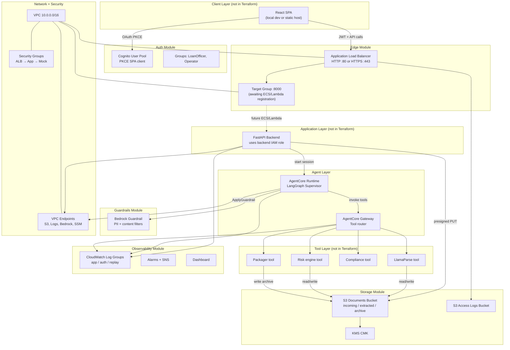
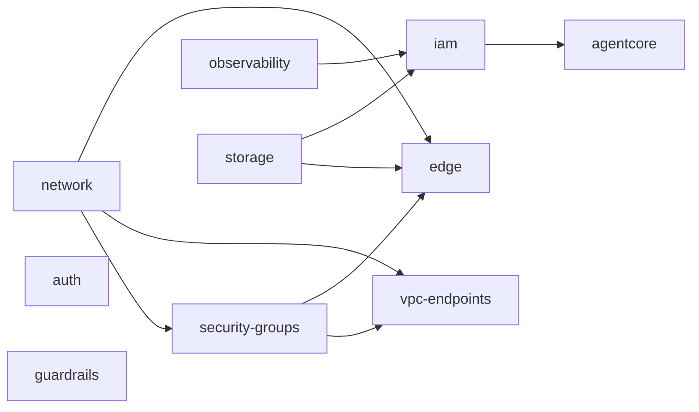
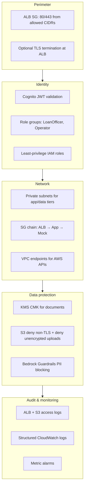

# Infrastructure as Code — Consumer Loan Origination AI

This document describes the Terraform infrastructure in this monorepo: what gets created, how the pieces fit together, and how each component supports the loan origination solution.

For application architecture and design rationale, see [`docs/design.md`](../docs/design.md). For deployment steps, see the root [`README.md`](../README.md).

---

## Table of contents

1. [Purpose and scope](#1-purpose-and-scope)
2. [Repository layout](#2-repository-layout)
3. [Deployment workflow](#3-deployment-workflow)
4. [Solution architecture](#4-solution-architecture)
5. [Module dependency graph](#5-module-dependency-graph)
6. [Bootstrap stack](#6-bootstrap-stack)
7. [Demo environment composition](#7-demo-environment-composition)
8. [Module reference](#8-module-reference)
   - [network](#81-network)
   - [security-groups](#82-security-groups)
   - [vpc-endpoints](#83-vpc-endpoints)
   - [storage](#84-storage)
   - [iam](#85-iam)
   - [edge](#86-edge)
   - [auth](#87-auth)
   - [agentcore](#88-agentcore)
   - [guardrails](#89-guardrails)
   - [observability](#810-observability)
9. [Configuration variables](#9-configuration-variables)
10. [Terraform outputs and application wiring](#10-terraform-outputs-and-application-wiring)
11. [Security model](#11-security-model)
12. [Naming and tagging conventions](#12-naming-and-tagging-conventions)
13. [What is not provisioned](#13-what-is-not-provisioned)
14. [Operational notes](#14-operational-notes)

---

## 1. Purpose and scope

The `infra/` directory contains **Terraform** definitions that provision AWS resources for the Consumer Loan Origination AI side project. The infrastructure supports:

| Capability | Primary AWS services |
|---|---|
| User authentication (SPA + API) | Amazon Cognito |
| Document storage and audit artifacts | Amazon S3 + KMS |
| Public API ingress | Application Load Balancer (ALB) |
| Agent orchestration | Amazon Bedrock AgentCore Runtime |
| Tool routing for agents | Amazon Bedrock AgentCore Gateway |
| Model safety controls | Amazon Bedrock Guardrails |
| Logging, metrics, and alerting | Amazon CloudWatch + SNS |
| Network isolation and private AWS access | VPC, subnets, NAT, VPC endpoints |
| Least-privilege access | IAM roles and policies |

**Default region:** `us-east-1`  
**Default environment:** `demo`  
**Terraform version:** `>= 1.7`  
**AWS provider:** `>= 5.50, < 6.0`

All resources are tagged via the demo environment provider:

| Tag | Value |
|---|---|
| `Project` | `loan-origination` (configurable) |
| `Environment` | `demo` (configurable) |
| `ManagedBy` | `terraform` |
| `Repository` | `Consumer-Loan-Origination-AI-AWS` |

---

## 2. Repository layout

```
infra/
├── bootstrap/              One-time remote state backend (S3 + DynamoDB + KMS)
├── envs/
│   └── demo/               Demo environment root module — wires all modules together
│       ├── main.tf         Module composition
│       ├── variables.tf    Environment-level input variables
│       ├── outputs.tf      Values exported to application .env files
│       ├── backend.tf      S3 remote state configuration
│       ├── versions.tf     Provider requirements
│       └── terraform.tfvars.example
└── modules/
    ├── network/            VPC, subnets, IGW, NAT, route tables
    ├── security-groups/    ALB, app, mock, VPC endpoint security groups
    ├── vpc-endpoints/      S3 gateway + interface endpoints (Logs, Bedrock, SSM)
    ├── storage/            S3 documents bucket, access-logs bucket, KMS
    ├── iam/                Runtime, backend, and gateway IAM roles
    ├── edge/               ALB, target group, optional ACM/Route53 TLS
    ├── auth/               Cognito user pool, SPA client, groups
    ├── agentcore/          AgentCore Runtime + Gateway (via boto3 script)
    ├── guardrails/         Bedrock Guardrail + version
    └── observability/      CloudWatch log groups, metrics, alarms, dashboard
```

Supporting automation outside `infra/` but invoked by Terraform:

| Script | Role |
|---|---|
| [`scripts/agentcore_provision.py`](../scripts/agentcore_provision.py) | Idempotent boto3 provisioning of AgentCore Runtime and Gateway (no first-class Terraform resource yet) |

---

## 3. Deployment workflow

Infrastructure is applied in **two stages**:

### Stage 1 — Bootstrap (once per AWS account/region)

Creates the Terraform remote state backend. Uses a **local backend** because the state bucket cannot store its own bootstrap state.

```bash
cd infra/bootstrap
terraform init
terraform apply
```

**Artifacts created:**

| Resource | Purpose |
|---|---|
| S3 bucket (`state_bucket_name`) | Encrypted remote Terraform state storage |
| KMS key + alias | Encrypts state objects at rest |
| DynamoDB table (`lock_table_name`) | State locking to prevent concurrent applies |
| Bucket policy | Denies non-TLS access to the state bucket |

After apply, copy the `backend_hcl_snippet` output into `infra/envs/demo/backend.tf` (or verify it matches the existing configuration).

### Stage 2 — Demo environment

Provisions the full application infrastructure.

```bash
cd infra/envs/demo
cp terraform.tfvars.example terraform.tfvars   # optional — defaults work for a no-domain demo
terraform init
terraform apply
```

State is stored remotely at:

```
s3://loan-origination-tf-state-demo/demo/terraform.tfstate
```

---

## 4. Solution architecture

The diagram below shows how provisioned infrastructure maps to the loan origination workflow.



### End-to-end request flow

1. **User authenticates** via Cognito Hosted UI (PKCE, no client secret). The SPA receives JWT access and ID tokens.
2. **User submits a loan application** through the React UI. The SPA calls the FastAPI backend with the JWT in the `Authorization` header.
3. **Backend validates the JWT** against the Cognito OIDC discovery URL, then generates a presigned S3 PUT URL so the SPA uploads PDFs directly to `incoming/{application_id}/`.
4. **Backend starts an AgentCore Runtime session** using the runtime execution IAM role permissions. The LangGraph supervisor orchestrates document parsing, risk evaluation, compliance checks, and packaging.
5. **Runtime invokes tools through AgentCore Gateway**, which reads from S3 (`incoming/`, `extracted/`) and writes results back (`extracted/`, `archive/`).
6. **Bedrock Guardrails** filter unsafe prompts and block PII (SSN, credit card numbers) in model interactions.
7. **Structured logs** flow to CloudWatch log groups; metric filters drive alarms and the operations dashboard.

---

## 5. Module dependency graph

Modules are composed in `infra/envs/demo/main.tf` in dependency order:



| Module | Depends on |
|---|---|
| `network` | — |
| `security-groups` | `network` (VPC ID, CIDR) |
| `vpc-endpoints` | `network`, `security-groups` |
| `observability` | — (created early so log group prefix is available to IAM) |
| `storage` | — |
| `iam` | `storage`, `observability` |
| `edge` | `network`, `security-groups`, `storage` |
| `auth` | — |
| `agentcore` | `iam` |
| `guardrails` | — |

`auth` and `guardrails` are independent and can be applied in parallel with other modules.

---

## 6. Bootstrap stack

**Path:** `infra/bootstrap/`

### Resources

| Terraform resource | AWS artifact | Description |
|---|---|---|
| `aws_kms_key.tf_state` | KMS CMK | Encrypts Terraform state objects |
| `aws_kms_alias.tf_state` | KMS alias | `alias/{prefix}-tf-state` |
| `aws_s3_bucket.tf_state` | S3 bucket | Remote state storage (`prevent_destroy = true`) |
| `aws_s3_bucket_versioning.tf_state` | Versioning config | Point-in-time recovery for state files |
| `aws_s3_bucket_server_side_encryption_configuration.tf_state` | SSE-KMS config | Encrypts all state objects |
| `aws_s3_bucket_public_access_block.tf_state` | Public access block | Blocks all public access |
| `aws_s3_bucket_policy.tf_state` | Bucket policy | Denies non-TLS (`aws:SecureTransport = false`) |
| `aws_dynamodb_table.tf_lock` | DynamoDB table | State locking (`LockID` hash key, pay-per-request) |

### Role in the solution

Bootstrap is **platform infrastructure**, not application infrastructure. It enables safe, collaborative Terraform operations: encrypted remote state, concurrent apply protection, and version history for state file recovery.

---

## 7. Demo environment composition

**Path:** `infra/envs/demo/`

The demo root module is a thin orchestrator. It does not define AWS resources directly — it passes variables into reusable modules and re-exports their outputs.

Default naming prefix: **`loan-origination-demo`**

Example resource names:

| Resource type | Example name |
|---|---|
| VPC | `loan-origination-demo-vpc` |
| ALB | `loan-origination-demo-alb` |
| Documents bucket | `loan-origination-demo-documents` |
| Cognito user pool | `loan-origination-demo-user-pool` |
| Guardrail | `loan-origination-demo-guardrail` |

---

## 8. Module reference

### 8.1 `network`

**Path:** `infra/modules/network/`

Creates the VPC foundation with a three-tier subnet model aligned with `docs/design.md` §11.2.

#### Resources

| Resource | Count | Description |
|---|---|---|
| `aws_vpc.main` | 1 | VPC with DNS hostnames/support enabled |
| `aws_internet_gateway.main` | 1 | Internet gateway for public subnets |
| `aws_subnet.public` | 2 (default) | Public subnets — one per AZ; hosts ALB and NAT |
| `aws_subnet.private_app` | 2 | Private app subnets — intended for FastAPI / ECS tasks |
| `aws_subnet.private_data` | 2 | Private data subnets — intended for mock tool backends |
| `aws_eip.nat` | 1 or 2 | Elastic IPs for NAT gateway(s) |
| `aws_nat_gateway.main` | 1 or 2 | Outbound internet for private subnets |
| `aws_route_table.public` | 1 | Routes `0.0.0.0/0` → IGW |
| `aws_route_table.private` | 1 or 2 | Routes `0.0.0.0/0` → NAT |
| Route table associations | 6 | Associates subnets with route tables |

#### Default CIDR layout

| Subnet tier | CIDR blocks | Purpose |
|---|---|---|
| VPC | `10.0.0.0/16` | Overall address space |
| Public | `10.0.0.0/24`, `10.0.1.0/24` | ALB, NAT gateway |
| Private app | `10.0.10.0/24`, `10.0.11.0/24` | Backend application services |
| Private data | `10.0.20.0/24`, `10.0.21.0/24` | Mock / integration services |

#### Role in the solution

Provides **network isolation** between public ingress (ALB), application workloads, and internal services. Private subnets ensure backend and tool services are not directly internet-reachable. NAT gateways allow outbound connectivity (e.g., LlamaParse API calls) from private subnets.

**Cost note:** `single_nat_gateway = true` (default) uses one NAT gateway for cost savings. Set to `false` for one NAT per AZ (high availability).

---

### 8.2 `security-groups`

**Path:** `infra/modules/security-groups/`

Implements the three-tier firewall model from `docs/design.md` §11.3.

#### Resources

| Security group | Inbound | Outbound |
|---|---|---|
| `aws_security_group.alb` | TCP 80, 443 from `allowed_ingress_cidrs` | TCP `app_port` (8000) to app SG |
| `aws_security_group.app` | TCP `app_port` from ALB SG only | TCP 443 to `0.0.0.0/0` (AWS APIs); TCP `mock_service_port` to mock SG |
| `aws_security_group.mock_service` | TCP `mock_service_port` from app SG only | TCP 443 to `0.0.0.0/0` |
| `aws_security_group.vpc_endpoint` | TCP 443 from VPC CIDR | TCP 443 to `0.0.0.0/0` |

Separate `aws_security_group_rule` resources wire cross-SG references without circular dependencies.

#### Role in the solution

Enforces **defense in depth**:

- Only the ALB is internet-facing.
- The FastAPI backend accepts traffic exclusively from the load balancer.
- Mock tool services (risk engine, compliance) accept traffic only from the app tier.
- VPC endpoint ENIs accept HTTPS only from within the VPC.

Restrict `allowed_ingress_cidrs` in production or demo environments to known IP ranges instead of the default `0.0.0.0/0`.

---

### 8.3 `vpc-endpoints`

**Path:** `infra/modules/vpc-endpoints/`

Reduces public internet egress for private workloads (`docs/design.md` §11.4).

#### Resources

| Endpoint | Type | Service | Purpose |
|---|---|---|---|
| `aws_vpc_endpoint.s3` | Gateway | `com.amazonaws.{region}.s3` | Private S3 access without NAT |
| `aws_vpc_endpoint.cloudwatch_logs` | Interface | `com.amazonaws.{region}.logs` | Log delivery from private subnets |
| `aws_vpc_endpoint.bedrock_runtime` | Interface | `com.amazonaws.{region}.bedrock-runtime` | Model invocation without public egress |
| `aws_vpc_endpoint.ssm` | Interface | `com.amazonaws.{region}.ssm` | Read AgentCore provisioning parameters |

Interface endpoints are placed in **private app subnets** and protected by the VPC endpoint security group.

#### Role in the solution

Allows the backend, AgentCore Runtime, and tool services running in private subnets to reach AWS APIs **without routing traffic through the NAT gateway**, improving security and reducing NAT data processing costs.

---

### 8.4 `storage`

**Path:** `infra/modules/storage/`

Manages document storage, encryption, lifecycle, and audit logging per `docs/design.md` §9.2.

#### Resources — documents bucket

| Resource | Description |
|---|---|
| `aws_kms_key.documents` | Customer-managed key (CMK) with rotation enabled |
| `aws_kms_alias.documents` | `alias/{prefix}-documents` |
| `aws_s3_bucket.documents` | Main documents bucket (`{prefix}-documents`) |
| `aws_s3_bucket_versioning.documents` | Versioning enabled for archive recovery |
| `aws_s3_bucket_server_side_encryption_configuration.documents` | SSE-KMS with bucket key |
| `aws_s3_bucket_logging.documents` | Access logs → access-logs bucket |
| `aws_s3_bucket_lifecycle_configuration.documents` | Prefix-based retention and transitions |
| `aws_s3_bucket_policy.documents` | Deny non-TLS; deny unencrypted uploads |
| `aws_s3_bucket_cors_configuration.documents` | Presigned PUT from SPA origins |
| `aws_s3_bucket_public_access_block.documents` | Block all public access |

#### S3 prefix layout

| Prefix | Content | Default retention |
|---|---|---|
| `incoming/{application_id}/` | Raw PDF uploads from presigned PUT | 30 days |
| `extracted/{application_id}/` | Normalized JSON from LlamaParse | 60 days |
| `archive/{application_id}/` | Final decision JSON + PDF audit artifacts | Transition to STANDARD_IA after 90 days |

#### Resources — access logs bucket

| Resource | Description |
|---|---|
| `aws_s3_bucket.access_logs` | Dedicated logging bucket (`{prefix}-s3-access-logs`) |
| `aws_s3_bucket_public_access_block.access_logs` | Block all public access |
| `aws_s3_bucket_lifecycle_configuration.access_logs` | Expire logs after 90 days (default) |
| `aws_s3_bucket_server_side_encryption_configuration.access_logs` | SSE-S3 (AES256) |
| `aws_s3_bucket_ownership_controls.access_logs` | `BucketOwnerPreferred` (required for ALB log ACLs) |
| `aws_s3_bucket_policy.access_logs` | Allows ELB / ALB log delivery principals |

Receives access logs from:

- The **documents bucket** (prefix `documents/`)
- The **ALB** (prefix `{prefix}-alb/`, via the edge module)

#### Role in the solution

S3 is the **system of record** for loan documents and decision artifacts:

1. SPA uploads PDFs to `incoming/` via backend-issued presigned URLs.
2. LlamaParse tool writes parsed JSON to `extracted/`.
3. Packager tool writes final decision packages to `archive/`.
4. KMS encryption and bucket policies enforce encryption-in-transit and encryption-at-rest.
5. Lifecycle rules control storage costs and data retention for a demo environment.

---

### 8.5 `iam`

**Path:** `infra/modules/iam/`

Defines three least-privilege execution roles (`docs/design.md` §4.3).

#### Roles and policies

##### Runtime execution role (`aws_iam_role.runtime_exec`)

**Assumed by:** AgentCore Runtime (Bedrock / AgentCore services)

| Attached policy | Permissions |
|---|---|
| `runtime_s3` | Read `incoming/`; read/write `extracted/`; write/read `archive/`; list bucket with prefix conditions |
| `runtime_bedrock` | `InvokeModel` / `InvokeModelWithResponseStream` on configured foundation model; `ApplyGuardrail` on project guardrails |
| `runtime_logs` | Create/write CloudWatch log streams under `/{project}/{env}/*` |
| `runtime_kms` | Decrypt, generate data key, describe documents CMK |
| `runtime_ssm` | Read SSM parameters under `/{project}/{env}/agentcore/*` |

##### Backend role (`aws_iam_role.backend`)

**Assumed by:** FastAPI service (ECS task or Lambda — not yet provisioned)

| Attached policy | Permissions |
|---|---|
| `backend_s3` | `PutObject` on `incoming/`; read `archive/` and `extracted/` |
| `backend_kms` | Generate data key, decrypt, describe documents CMK |
| `backend_logs_metrics` | Write CloudWatch logs; put custom metrics in `{project}/{env}` namespace |
| `backend_agentcore` | Create/invoke AgentCore Runtime sessions |

##### Gateway tool role (`aws_iam_role.gateway_tool`)

**Assumed by:** AgentCore Gateway when executing tools

| Attached policy | Permissions |
|---|---|
| `gateway_tool` | Read `incoming/` and `extracted/`; decrypt via KMS; write logs; read SSM parameters under `/{project}/{env}/*` |

#### Role in the solution

IAM roles enforce **least privilege** across the agentic pipeline:

- The runtime can orchestrate workflows and call Bedrock but cannot issue presigned upload URLs.
- The backend can authenticate users and start sessions but cannot directly invoke foundation models.
- The gateway can read documents for tool execution but cannot write to `archive/`.

All S3 and KMS permissions are scoped to the specific bucket ARN and CMK ARN created by the storage module.

---

### 8.6 `edge`

**Path:** `infra/modules/edge/`

Provides public ingress for the FastAPI backend via an Application Load Balancer.

#### Resources

| Resource | Condition | Description |
|---|---|---|
| `aws_acm_certificate.main` | `enable_ssl = true` | ACM certificate with DNS validation |
| `aws_route53_record.cert_validation` | SSL + `route53_zone_id` set | Automatic DNS validation CNAME records |
| `aws_acm_certificate_validation.main` | `enable_ssl = true` | Waits for certificate issuance |
| `aws_lb.main` | Always | Internet-facing ALB in public subnets |
| `aws_lb_target_group.app` | Always | HTTP target group on port 8000, health check `/health` |
| `aws_lb_listener.https` | `enable_ssl = true` | HTTPS :443 → forward to target group |
| `aws_lb_listener.http_redirect` | `enable_ssl = true` | HTTP :80 → 301 redirect to HTTPS |
| `aws_lb_listener.http` | `enable_ssl = false` (default) | HTTP :80 → forward to target group |
| `aws_route53_record.alb` | SSL + `route53_zone_id` set | Alias A record pointing custom domain to ALB |

#### SSL modes

| Mode | `enable_ssl` | Behavior |
|---|---|---|
| **Plain HTTP** (default) | `false` | No ACM certificate; ALB serves HTTP on port 80; use `alb_dns_name` output as API endpoint |
| **HTTPS** | `true` | Requires `domain_name`; ACM cert + HTTPS listener; HTTP redirects to HTTPS |

TLS terminates at the ALB. Traffic from ALB to the application target group is **plain HTTP** on port 8000 within the VPC.

#### Role in the solution

The ALB is the **single public entry point** for the FastAPI API:

- Terminates TLS (when enabled) before traffic reaches the backend.
- Performs health checks against `/health` to route only to healthy targets.
- Writes access logs to the S3 access-logs bucket for request auditing.
- The target group (`app_target_group_arn`) is ready for ECS task or IP target registration — compute is not provisioned by this Terraform stack (see [§13](#13-what-is-not-provisioned)).

---

### 8.7 `auth`

**Path:** `infra/modules/auth/`

Provisions Amazon Cognito for user authentication (`docs/design.md` §4.1).

#### Resources

| Resource | Description |
|---|---|
| `aws_cognito_user_pool.main` | Email-based user pool with strong password policy |
| `aws_cognito_user_pool_client.spa` | Public SPA client — PKCE, no client secret |
| `aws_cognito_user_pool_domain.main` | Hosted UI domain (`{prefix}-auth`) |
| `aws_cognito_user_group.loan_officer` | `LoanOfficer` group (precedence 10) |
| `aws_cognito_user_group.operator` | `Operator` group (precedence 1) |

#### Key configuration

| Setting | Value | Rationale |
|---|---|---|
| Username attribute | Email | Standard enterprise login pattern |
| OAuth flow | Authorization Code + PKCE | Secure SPA authentication without client secret |
| Token validity | Access/ID: 1 hour; Refresh: 30 days | Short-lived access tokens |
| MFA | `OFF` by default (configurable) | Demo simplicity; TOTP enabled automatically when set to `OPTIONAL` or `ON` |
| Advanced security | AUDIT mode | Logs anomalous sign-in patterns without blocking |
| User existence errors | Prevented | Mitigates user enumeration attacks |

#### Role in the solution

Cognito provides **identity and access** for the React SPA and API:

1. Users sign in via the Cognito Hosted UI.
2. The SPA receives JWT access tokens.
3. The FastAPI backend validates JWTs against the OIDC discovery URL.
4. Cognito groups (`LoanOfficer`, `Operator`) map to application role separation — loan officers submit and review applications; operators manage configuration and infrastructure.

---

### 8.8 `agentcore`

**Path:** `infra/modules/agentcore/`

Provisions Amazon Bedrock AgentCore Runtime and Gateway. Because the AWS Terraform provider does not yet expose first-class resources for AgentCore, this module uses a **`data "external"`** block that invokes `scripts/agentcore_provision.py`.

#### How it works

```
Terraform apply
  └─> data.external.agentcore
        └─> python3 scripts/agentcore_provision.py  (boto3, idempotent)
              ├─> Create/update AgentCore Runtime (LangGraph supervisor)
              ├─> Create/update AgentCore Gateway (tool router)
              └─> Write JSON results to stdout → Terraform outputs
```

#### Outputs (from provisioning script)

| Output | Description |
|---|---|
| `runtime_arn` | AgentCore Runtime ARN for LangGraph supervisor |
| `runtime_id` | Short runtime identifier |
| `gateway_arn` | AgentCore Gateway ARN |
| `gateway_id` | Short gateway identifier |
| `gateway_endpoint_url` | Gateway endpoint for tool invocations |
| `provisioning_status` | `ok`, `skipped`, or `error` |

The script receives `runtime_role_arn`, `gateway_role_arn`, and `bedrock_model_id` from Terraform and stores provisioning metadata in SSM (readable by the IAM roles).

#### Role in the solution

AgentCore is the **agent hosting and tool routing layer**:

- **Runtime** runs the LangGraph supervisor and specialist subgraphs (document extraction, risk, compliance, packaging).
- **Gateway** exposes tools (`llamaparse.parse_financial_pdf`, `risk_engine.evaluate`, etc.) with standardized interfaces and IAM-backed authorization.
- The FastAPI backend starts runtime sessions; the runtime invokes tools through the gateway.

If AgentCore is unavailable in the region or account, the script reports `skipped` and the application can fall back to local in-process LangGraph (`RUNTIME_MODE=local`).

---

### 8.9 `guardrails`

**Path:** `infra/modules/guardrails/`

Creates an Amazon Bedrock Guardrail for model safety (`docs/design.md` §10.4).

#### Resources

| Resource | Description |
|---|---|
| `aws_bedrock_guardrail.main` | Guardrail with PII, topic, and content policies |
| `aws_bedrock_guardrail_version.main` | Version `V1` snapshot |

#### Policy configuration

| Policy type | Configuration |
|---|---|
| **Sensitive information** | Block US Social Security Numbers and credit/debit card numbers |
| **Topic** | Deny offensive/harmful/violent content |
| **Content filters** | HIGH strength on HATE, INSULTS, SEXUAL, VIOLENCE, MISCONDUCT; PROMPT_ATTACK on input only (output = NONE per AWS constraint) |

#### Role in the solution

Guardrails provide a **safety layer** for Bedrock model interactions in the agentic runtime:

- Blocks PII from appearing in model-generated responses (defense in depth — structured tool outputs should not rely on Guardrails alone for redaction).
- Filters harmful content categories.
- Detects prompt injection / prompt attack patterns on inputs.

The runtime IAM role includes `bedrock:ApplyGuardrail` permission. Configure `BEDROCK_GUARDRAIL_ID` and `BEDROCK_GUARDRAIL_VERSION` in application `.env` files.

---

### 8.10 `observability`

**Path:** `infra/modules/observability/`

Provides logging, metrics, alerting, and an operations dashboard (`docs/design.md` §10).

#### CloudWatch log groups

| Log group | Path | Content |
|---|---|---|
| `aws_cloudwatch_log_group.app` | `/{project}/{env}/app` | Application, agent, and tool traces |
| `aws_cloudwatch_log_group.auth` | `/{project}/{env}/auth` | Authentication attempts and failures |
| `aws_cloudwatch_log_group.replay` | `/{project}/{env}/replay` | Evaluation harness replay runs |

Default retention: **30 days** (configurable via `log_retention_days`).

#### Metric filters

Structured JSON log patterns are converted to CloudWatch custom metrics in the `{project}/{env}` namespace:

| Metric | Source log group | Pattern |
|---|---|---|
| `AuthFailures` | auth | `level = ERROR` AND `event_type = AUTH_FAILURE` |
| `AppErrors` | app | `level = ERROR` |
| `DriftEvents` | replay | `event_type = DRIFT_DETECTED` |
| `GoldenCaseAccuracy` | replay | `event_type = METRICS_REPORT` → `accuracy_pct` field |
| `FalsePositives` | replay | `event_type = METRICS_REPORT` → `false_positive_count` field |
| `FalseNegatives` | replay | `event_type = METRICS_REPORT` → `false_negative_count` field |

#### Alarms

| Alarm | Threshold (default) | Evaluation |
|---|---|---|
| `auth_failures` | > 10 per 5 min | 2 consecutive periods |
| `app_errors` | > 25 per 5 min | 2 consecutive periods |
| `drift_spike` | > 1 per hour | 1 period |
| `accuracy_drop` | < 90% average | 1 period |

All alarms publish to an SNS topic (`aws_sns_topic.alarms`) for notification routing.

#### Dashboard

`aws_cloudwatch_dashboard.main` (`{prefix}-dashboard`) includes:

- Time-series widgets: auth failures, app errors, drift events, golden-case accuracy, false positives/negatives
- Log widget: recent application errors (last 20)
- Alarm status widgets: drift, accuracy, and auth failure alarms

#### Role in the solution

Observability supports **operational visibility and evaluation quality**:

- Application and auth logs enable debugging and security review.
- The evaluation harness (`evaluation/` package) writes replay metrics to the replay log group; metric filters surface accuracy and drift on the dashboard.
- Alarms provide early warning for auth attacks, application errors, risk engine drift, and accuracy regression.

---

## 9. Configuration variables

Key variables in `infra/envs/demo/variables.tf`. Copy `terraform.tfvars.example` to `terraform.tfvars` to override defaults.

### Identity

| Variable | Default | Description |
|---|---|---|
| `project_name` | `loan-origination` | Resource name prefix |
| `environment` | `demo` | Environment label |
| `region` | `us-east-1` | AWS region |

### Networking

| Variable | Default | Description |
|---|---|---|
| `vpc_cidr` | `10.0.0.0/16` | VPC CIDR block |
| `public_subnet_cidrs` | `10.0.0.0/24`, `10.0.1.0/24` | Public subnet CIDRs |
| `private_app_subnet_cidrs` | `10.0.10.0/24`, `10.0.11.0/24` | Private app subnet CIDRs |
| `private_data_subnet_cidrs` | `10.0.20.0/24`, `10.0.21.0/24` | Private data subnet CIDRs |
| `single_nat_gateway` | `true` | One NAT (cost-saving) vs one per AZ (HA) |
| `allowed_ingress_cidrs` | `["0.0.0.0/0"]` | CIDRs allowed to reach the ALB |
| `app_port` | `8000` | Backend application port |
| `mock_service_port` | `8080` | Mock tool service port |

### TLS / Edge

| Variable | Default | Description |
|---|---|---|
| `enable_ssl` | `false` | Enable HTTPS via ACM (requires a domain) |
| `domain_name` | `""` | FQDN for ACM certificate (required when `enable_ssl = true`) |
| `route53_zone_id` | `""` | Route53 zone for automatic DNS validation and ALB alias |

### Storage

| Variable | Default | Description |
|---|---|---|
| `incoming_retention_days` | `30` | Days before `incoming/` objects expire |
| `extracted_retention_days` | `60` | Days before `extracted/` objects expire |
| `access_log_retention_days` | `90` | Days before access log objects expire |
| `cors_allowed_origins` | `["http://localhost:5173"]` | SPA origins for presigned PUT uploads |

### Auth

| Variable | Default | Description |
|---|---|---|
| `cognito_callback_urls` | `["http://localhost:5173"]` | OAuth redirect URIs after login |
| `cognito_logout_urls` | `["http://localhost:5173"]` | Post-logout redirect URIs |
| `cognito_mfa_configuration` | `OFF` | Cognito MFA policy (`OFF`, `OPTIONAL`, `ON`) |

### Observability

| Variable | Default | Description |
|---|---|---|
| `log_retention_days` | `30` | CloudWatch log retention |
| `auth_failure_alarm_threshold` | `10` | Auth failures per 5-min window before alarm |
| `app_error_alarm_threshold` | `25` | App errors per 5-min window before alarm |

### AI / Bedrock

| Variable | Default | Description |
|---|---|---|
| `bedrock_model_id` | `anthropic.claude-3-5-sonnet-20241022-v2:0` | Foundation model for runtime and IAM scoping |

Ensure the chosen model is **enabled in Bedrock Model Access** for your AWS account and region before applying.

---

## 10. Terraform outputs and application wiring

After `terraform apply`, map outputs to application environment files:

### Backend (`backend/.env`)

| Terraform output | Environment variable |
|---|---|
| `cognito_user_pool_id` | `COGNITO_USER_POOL_ID` |
| `cognito_spa_client_id` | `COGNITO_CLIENT_ID` |
| `oidc_discovery_url` | Used for JWT validation configuration |
| `documents_bucket_name` | `S3_BUCKET_NAME` |
| `documents_kms_key_arn` | KMS configuration (if needed) |
| `agentcore_runtime_arn` | `AGENTCORE_RUNTIME_ARN` |
| `agentcore_gateway_arn` | `AGENTCORE_GATEWAY_ARN` |
| `bedrock_guardrail_id` | `BEDROCK_GUARDRAIL_ID` |
| `bedrock_guardrail_version` | `BEDROCK_GUARDRAIL_VERSION` |
| `app_log_group_name` | CloudWatch log group for application logs |
| `auth_log_group_name` | CloudWatch log group for auth logs |
| `backend_role_arn` | IAM role for ECS/Lambda task (when deployed) |

### Frontend (`frontend/.env`)

| Terraform output | Environment variable |
|---|---|
| `cognito_user_pool_id` | `VITE_COGNITO_USER_POOL_ID` |
| `cognito_spa_client_id` | `VITE_COGNITO_USER_POOL_CLIENT_ID` |
| `cognito_hosted_ui_domain` | `VITE_COGNITO_OAUTH_DOMAIN` (construct full Hosted UI URL) |

### Agents (`agents/.env`)

| Terraform output | Environment variable |
|---|---|
| `agentcore_runtime_arn` | `AGENTCORE_RUNTIME_ARN` |
| `agentcore_gateway_arn` | `AGENTCORE_GATEWAY_ARN` |
| `documents_bucket_name` | `S3_BUCKET_NAME` |
| `bedrock_guardrail_id` | `BEDROCK_GUARDRAIL_ID` |
| `bedrock_guardrail_version` | `BEDROCK_GUARDRAIL_VERSION` |

### Infrastructure references

| Terraform output | Use |
|---|---|
| `vpc_id` | ECS task networking, future compute deployment |
| `private_app_subnet_ids` | Place backend ECS tasks in private subnets |
| `alb_dns_name` | API endpoint URL (HTTP default, or HTTPS with custom domain) |
| `app_target_group_arn` | Register ECS tasks or IP targets with the ALB |
| `runtime_exec_role_arn` | AgentCore Runtime execution role |
| `dashboard_name` | CloudWatch console dashboard link |
| `alarms_sns_topic_arn` | Subscribe email/Slack for alarm notifications |

---

## 11. Security model

### Defense layers



### Key security properties

| Property | Implementation |
|---|---|
| Encryption at rest | KMS CMK for documents bucket; SSE-S3 for access logs; KMS for Terraform state |
| Encryption in transit | TLS at ALB (when enabled); S3 bucket policy denies non-TLS; HTTPS-only VPC endpoints |
| Least privilege | Three IAM roles scoped to specific S3 prefixes, one model ID, and project log groups |
| No public data access | S3 public access blocks on all buckets |
| Authentication | Cognito PKCE for SPA; JWT validation at API boundary |
| Authorization | Cognito groups + IAM role separation |
| PII protection | Guardrail blocks SSN and credit card numbers in model I/O |
| Audit trail | S3 access logging, ALB access logging, structured application/auth logs |

---

## 12. Naming and tagging conventions

### Resource naming

Pattern: `{project_name}-{environment}-{resource-type}`

Examples with defaults (`loan-origination`, `demo`):

```
loan-origination-demo-vpc
loan-origination-demo-alb
loan-origination-demo-documents        (S3 bucket)
loan-origination-demo-user-pool
loan-origination-demo-runtime-exec-role
loan-origination-demo-guardrail
```

S3 bucket names are globally unique and omit additional suffixes beyond the prefix.

### Log group paths

```
/{project_name}/{environment}/app
/{project_name}/{environment}/auth
/{project_name}/{environment}/replay
```

### CloudWatch metric namespace

```
{project_name}/{environment}
```

Example: `loan-origination/demo`

---

## 13. What is not provisioned

The Terraform stack deliberately **does not** create the following. They are expected to run locally during development or require additional deployment steps:

| Component | Status | Notes |
|---|---|---|
| **ECS / EKS / Lambda** for FastAPI | Not provisioned | Backend runs locally via `uvicorn`; IAM backend role and ALB target group are ready for future ECS deployment |
| **ECR container registry** | Not provisioned | No container images built or pushed by Terraform |
| **Frontend hosting** (S3/CloudFront) | Not provisioned | React SPA runs locally via Vite dev server |
| **Route53 hosted zone** | Not provisioned | Optional; provide `route53_zone_id` if you own a domain |
| **LlamaParse** | External SaaS | API key configured in application `.env`, not Terraform |
| **SNS subscriptions** | Not provisioned | SNS topic created; add email/webhook subscriptions manually |
| **Cognito users** | Not provisioned | Create users via AWS Console or CLI after apply |
| **Mock tool ECS services** | Not provisioned | Security groups and subnets are ready; services run locally or need separate deployment |
| **WAF** | Not provisioned | ALB is open to configured CIDRs; add AWS WAF for production |
| **Secrets Manager / SSM secrets** | Not provisioned | Application secrets (LlamaParse API key, etc.) managed via local `.env` files |

---

## 14. Operational notes

### Re-applying after changes

```bash
cd infra/envs/demo
terraform plan    # review changes
terraform apply
```

### Destroying the demo environment

```bash
cd infra/envs/demo
terraform destroy
```

Bootstrap resources (state bucket, lock table) are **not** destroyed by demo environment teardown. The state bucket has `prevent_destroy = true`.

### Enabling HTTPS later

1. Register or use an existing domain.
2. Create a Route53 hosted zone (or use an existing one).
3. Set in `terraform.tfvars`:
   ```hcl
   enable_ssl      = true
   domain_name     = "demo.your-domain.com"
   route53_zone_id = "Z0123456789ABCDEFGHIJ"
   ```
4. Update `cognito_callback_urls`, `cognito_logout_urls`, and `cors_allowed_origins` to include the HTTPS domain.
5. Run `terraform apply`.

### AgentCore reprovisioning

AgentCore resources are managed by `scripts/agentcore_provision.py`. Re-provisioning is triggered when `runtime_role_arn`, `gateway_role_arn`, `project_name`, `environment`, or `bedrock_model_id` change. Check `agentcore_provisioning_status` output after apply.

### Linting

Terraform lint configuration: `infra/.tflint.hcl`

### Cost optimization for demo

| Choice | Default | Impact |
|---|---|---|
| `single_nat_gateway = true` | Yes | One NAT gateway (~$32/month) instead of two |
| `enable_ssl = false` | Yes | No ACM certificate or Route53 records |
| Interface VPC endpoints | 3 endpoints | ~$7/month each + data processing; disable if not needed |
| Log retention | 30 days | Reduce via `log_retention_days` |
| S3 lifecycle | Enabled | Auto-expires incoming/extracted; archive transitions to IA |

### Related documentation

| Document | Content |
|---|---|
| [`docs/design.md`](../docs/design.md) | Full system design including network, security, and Terraform sections |
| [`docs/requirements.md`](../docs/requirements.md) | Functional and non-functional requirements |
| [`docs/implementation-plan.md`](../docs/implementation-plan.md) | Phased implementation tasks |
| [`docs/adr/0001-stack-choices.md`](../docs/adr/0001-stack-choices.md) | Architecture decision record for stack choices |
| Root [`README.md`](../README.md) | Quick start and local development guide |
